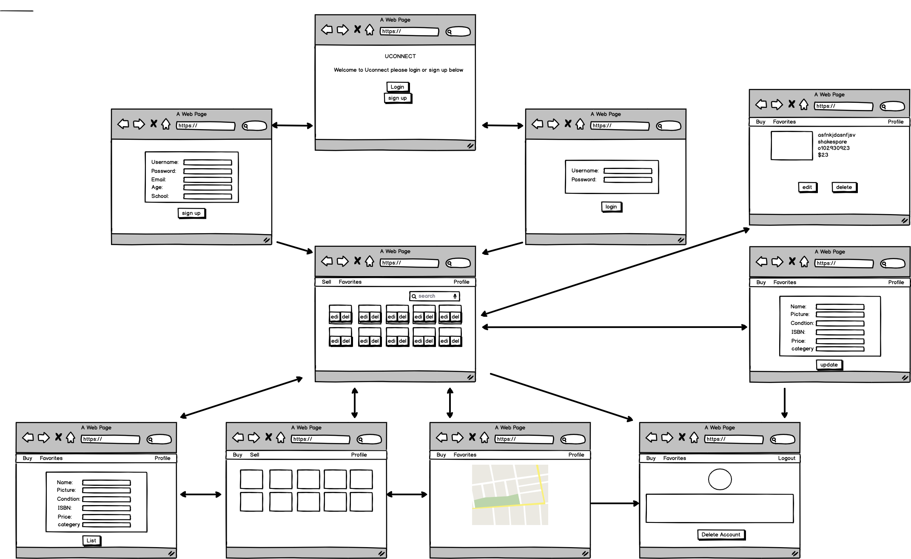

## UConnect

## `Overview`
Uconnect is a book selling app that enables students **sell** books to people that are **close** to them, one of the top priorities for this app is to allow the students to select their schools when signing up and it displays search results based on books that were posted by users in the same school.

### `Technology`
- React
- Flask
- Javascript
- Python
- Postgrees
- Peewee
- Semantic-ui
- MapBox Maps Api
- cloudinery

## WireFrame
	

## User Story
- User should be able to register and go to feeds for viewing books for sale around them. 
- User should be able to sign in and got to feeds for viewing books for sale around them. 
- User should be able to shortlist books for sale. 
- User should be able to view books for sale around them. 
- User should be able to delete their own listing.
- User should be able to edit their own listing.
- User should be able to adjust the distance of books for sale from them.
- User should be able to favorite books that they plan to buy. 
- User should be able to buy books 
- User should be able to see other buyers profile if they go to the same school.
- User should be able to delete their own account and all their listing. 
- User should be able to change their schools. 
- User should be able to logout. 

## Routes
| Verb | Routes | Function|
|------|--------|---------|
|GET   |/books  |Shows all books|
|GET   |/users/login|Logs in user|
|POST  |/users/register|Registers a user|
|GET   |/books/id|Shows info of a specific book|
|POST  |/books|creates new book|
|PUT   |/books/:id|Updates a book|
|DELETE|/books/:id|Deletes a book|
|POST  |/favorite/:id|favorites a book for a user|
|GET   |/books/:zip|Gets book near a zip code|
|GET   |/books/:isbn|Finds books using isbn|
|GET   |/books/choice|Finds books depends on user selection|

## Models
class User(UserMixin,Model){

	username = CharField(unique=True)
	latitude = DecimalField()
	longitude = DecimalField()
	age = IntegerField()
	email = CharField(unique=True)
	password = CharField()
	school = CharField()
}

class Book(Model){

	title = CharField()
	ISBN = CharField()
	description = TextField()
	created_date = DateTimeField(default=datetime.datetime.now)
	Sold = BooleanField()
	owner = ForeignKeyField(User, backref='Books')
	image = CharField()
	address= CharField()
}
class Favorite(Model){
	
	UserId = ForeignKeyField(User, backref='Favorite')
	Book_Id =ForeignKeyField(Book, backref='Favorite')
}

## Sprints
- sprint 1 : complete all api routes to complete CRUD √
- sprint 2 : models remodifiaction √
- sprint 3 : setup react and dependencies √
- sprint 4 : login register form √
- sprint 5 : login register validation √
- sprint 6 : search & mapbox integration, image uplaod for books √
- sptiny 7 : show page and index page for books
- sprint 7 : client side CRUD for books √
- sprint 8 : notification and favorites CRUD v
- sprint 9 : delete listing and user delete acount√